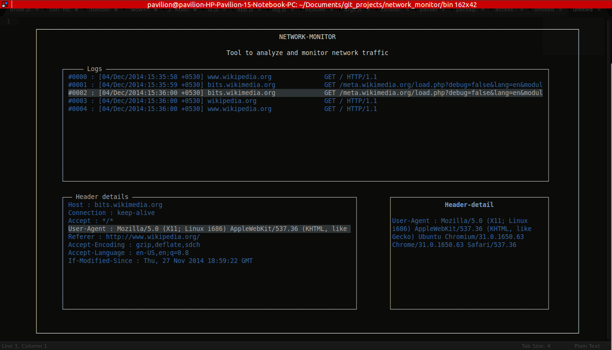

# network-monitor

> Tool to analyze and monitor network traffic

- Current support for HTTP traffic
- Log's to a file
- A TUI based responsive display
- Written in Node.js

### Screenshot



## Installation

```
[sudo] npm install network-monitor -g
```

## Usage

```
[sudo] network-monitor -h
```

## Dependencies

- libpcap-dev: library for network traffic capture
- [mranney/node_pcap](https://github.com/mranney/node_pcap): libpcap bindings for node
- [codenothing/argv](https://github.com/codenothing/argv): for command line argument parsing
- [chjj/blessed](https://github.com/chjj/blessed): A curses-like library for node.js.
- [moment/moment](https://github.com/moment/moment): For parsing the time

## Common Issue

### IPv6

IPv6 is not yet supported. use the filter `ip proto \tcp` to filter out IPv6 packets.

## Developer
[Dhaval Kapil](https://dhavalkapil.com/)
